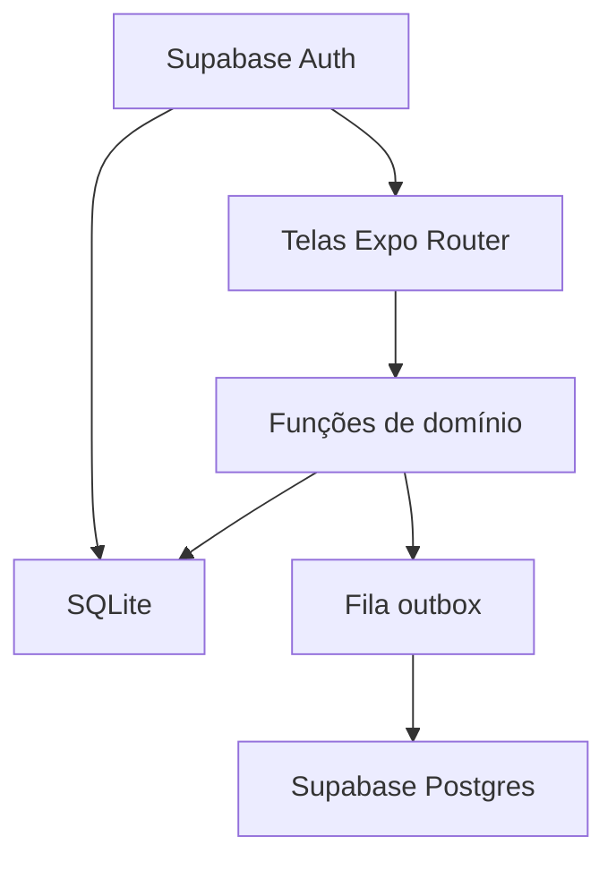

# Workout MVP Design

**Spec**: `.specs/features/workout-mvp/spec.md`
**Status**: Approved

---

## Architecture Overview

A tela lê e grava só no SQLite do aparelho. O Supabase guarda a conta e a cópia de servidor. Uma fila (`outbox`) envia as linhas novas ou alteradas quando há rede. O id de cada linha nasce no aparelho. Reenviar faz upsert nessa chave, então a série concluída não duplica.

O catálogo de exercícios é semente do app, com os mesmos ids no Postgres, para a sessão referenciar um exercício que já existe nos dois lados. Treino, dias preenchidos, sessão, série e o descanso padrão são dados do usuário.



A tela não decide regra de negócio. Ela chama `src/lib/` e desenha o resultado. Banco, auth, agenda, sessão e fila ficam nesses módulos. Hook só existe quando duas telas precisam da mesma leitura, como a sessão em andamento.

```
src/app/                 telas (Expo Router)
src/components/ui/       botão, cartão, modal, tela-base
src/components/          bloco reutilizado por mais de uma tela
src/hooks/               leitura compartilhada entre telas
src/lib/auth.ts          Supabase Auth
src/lib/db.ts            SQLite, tabelas, catálogo, gravações
src/lib/workout.ts       agenda, modelo, sessão, descanso
src/lib/sync.ts          fila e upsert
src/constants/theme.ts   cor, espaço, raio, borda
```

Nada além disso. Um arquivo novo só aparece quando o mesmo bloco é usado em duas telas. As telas de exemplo do template (`index`, `explore`, abas) saem quando as rotas do produto entram.

---

## Code Reuse Analysis

### Existing Components to Leverage

| Component | Location | How to Use |
| --- | --- | --- |
| Tokens | `src/constants/theme.ts` | Passa a guardar a paleta, o espaço, o raio e a borda desta versão. |
| Texto e view | `src/components/themed-text.tsx`, `src/components/themed-view.tsx` | Continuam como primitivos, lendo os tokens novos. |
| Tema do sistema | `src/hooks/use-theme.ts`, `src/hooks/use-color-scheme.ts` | Claro e escuro já ligados no root layout. |

### Integration Points

| System | Integration Method |
| --- | --- |
| Supabase Auth | `@supabase/supabase-js`. Sessão persistida com `expo-sqlite/localStorage`, como no guia Expo de Supabase. Google pelo fluxo de browser (`expo-web-browser`). E-mail e senha por `signUp` / `signInWithPassword`. |
| Supabase Postgres | Upsert das linhas da fila. RLS: `user_id = auth.uid()` nas tabelas do usuário. Catálogo é leitura para qualquer autenticado. |
| SQLite | `expo-sqlite` para o banco do treino e para a sessão de auth. |

Não há módulo de treino, teste ou cliente HTTP no repositório hoje. O template de abas não entra no fluxo.

---

## Schedule

O dia sugerido usa o weekday local do aparelho. Trocar o treino na hora não muda este mapa.

| Modelo | Segunda | Terça | Quarta | Quinta | Sexta | Sábado | Domingo |
| --- | --- | --- | --- | --- | --- | --- | --- |
| ABC | A | — | B | — | C | — | — |
| ABCDE | A | B | C | D | E | — | — |
| ABC 2x | A1 | B1 | C1 | A2 | B2 | C2 | — |
| PPL | Push | Pull | Legs | Push 2 | Pull 2 | Legs 2 | — |
| Full body | Full | — | Full | — | Full | — | — |

Dia sem letra: a tela inicial diz que não há sugestão e lista os dias do modelo para escolha. PPL aqui é o ciclo de seis dias. Um PPL de três dias não é outro modelo nesta versão.

---

## Components

### Auth client

- **Purpose**: Login Google, registro e login com e-mail e senha, e a sessão atual.
- **Location**: `src/lib/auth.ts`
- **Interfaces**:
  - `signInWithGoogle(): Promise<void>`
  - `signUpWithPassword(email: string, password: string): Promise<void>`
  - `signInWithPassword(email: string, password: string): Promise<void>`
  - `getSession(): Promise<Session | null>`
- **Dependencies**: Supabase Auth, `expo-web-browser`, `expo-sqlite/localStorage`
- **Reuses**: nenhum módulo de auth existente

### Banco local

- **Purpose**: Abrir o SQLite, criar as tabelas e aplicar a semente do catálogo.
- **Location**: `src/lib/db.ts`
- **Interfaces**:
  - `getDatabase(): Promise<SQLiteDatabase>`
  - `migrate(): Promise<void>`
- **Dependencies**: `expo-sqlite`
- **Reuses**: o mesmo módulo que a sessão de auth usa para storage

### Catálogo

- **Purpose**: Listar exercícios com músculos e ênfase. Não cria exercício de usuário.
- **Location**: `src/lib/db.ts`
- **Interfaces**:
  - `listExercises(): Promise<Exercise[]>`
  - `getExercise(id: string): Promise<Exercise>`
- **Dependencies**: o mesmo arquivo do banco
- **Reuses**: semente com ids estáveis, inclusive `bench-press`

### Modelos e agenda

- **Purpose**: Listar os cinco modelos, gravar o modelo ativo, preencher cada dia e sugerir o dia de hoje.
- **Location**: `src/lib/workout.ts`
- **Interfaces**:
  - `listTemplates(): Template[]`
  - `suggestedDay(templateId: string, weekday: number): DayId | null`
  - `saveActiveProgram(templateId: string): Promise<Program>`
  - `addExercise(programId: string, dayId: string, exerciseId: string, plannedSets: number): Promise<void>`
  - `completeProgram(programId: string): Promise<void>` — falha se algum dia está sem exercício
- **Dependencies**: `src/lib/db.ts`, mapa da seção Schedule
- **Reuses**: nenhum

### Sessão de treino

- **Purpose**: Uma sessão em andamento, séries concluídas, descanso e encerramento.
- **Location**: `src/lib/workout.ts`
- **Interfaces**:
  - `startSession(programId: string, dayId: string): Promise<Session>` — recusa se já existe sessão `in_progress`
  - `completeSet(sessionId: string, exerciseId: string, kg: number, reps: number, startedAt: Date, completedAt: Date): Promise<SetLog>`
  - `addExtraSet(sessionId: string, exerciseId: string): Promise<void>`
  - `skipRemainingSets(sessionId: string, exerciseId: string): Promise<void>`
  - `completeSession(sessionId: string): Promise<void>`
  - `getDefaultRestSeconds(userId: string): Promise<number>`
  - `setDefaultRestSeconds(userId: string, seconds: number): Promise<void>` — recusa `seconds < 1`
- **Dependencies**: `src/lib/db.ts`, `src/lib/sync.ts`
- **Reuses**: nenhum
- **Rule**: série só é inserida na conclusão. Processo morto no meio da série não deixa linha.

### Fila de sync

- **Purpose**: Copiar linhas do usuário para o Supabase e tolerar rede ausente.
- **Location**: `src/lib/sync.ts`
- **Interfaces**:
  - `enqueue(row: SyncRow): Promise<void>`
  - `flush(): Promise<void>` — upsert por id; linha sincronizada sai da fila; falha de rede mantém a fila
- **Dependencies**: Supabase client, SQLite
- **Reuses**: ids criados no aparelho

### Telas

- **Purpose**: Login, início, cadastro do modelo, lista do dia, exercício com séries e descanso.
- **Location**:
  - `src/app/login.tsx`
  - `src/app/(app)/index.tsx`
  - `src/app/(app)/program/index.tsx`
  - `src/app/(app)/program/[dayId].tsx`
  - `src/app/(app)/session/[sessionId].tsx`
  - `src/app/(app)/session/[sessionId]/[exerciseId].tsx`
- **Interfaces**: só navegação Expo Router e chamadas às funções acima
- **Dependencies**: domínio e auth
- **Reuses**: `ThemedText`, `ThemedView`, componentes em `src/components/ui/`

O descanso da vez é estado da tela. Reiniciar o timer com outra duração não chama `setDefaultRestSeconds`.

A sessão em andamento aparece na tela inicial. `src/hooks/use-active-session.ts` é a única leitura compartilhada: a home e a tela da sessão usam a mesma função.

### Saída da tela

Montar o modelo, preencher um dia e registrar a sessão interceptam o voltar enquanto o fluxo não foi concluído. O modal tem duas ações: ficar, ou sair.

Sair não apaga o que já foi gravado no SQLite. No registro do treino, a sessão continua `in_progress`. A pessoa navega o resto do app e, pela tela inicial, reabre o mesmo treino com as séries já concluídas. A série iniciada e ainda não concluída continua sem linha, como no spec.

---

## UI

A mesma interface nos dois sistemas. Componentes nossos, com cara de app iOS: fundo claro, agrupamento em cartões, um botão primário por tela, área de toque folgada, número de carga grande. Não usamos controle nativo diferente por plataforma.

Tokens em `src/constants/theme.ts`:

| Token | Valor | Uso |
| --- | --- | --- |
| primary | `#2C7A7F` | Botão primário, dia selecionado |
| accent | `#4FD1C5` | Destaque, timer de descanso |
| ink | `#2C3E50` | Texto |
| surface | `#E6FFFA` | Fundo de cartão |
| danger | `#FF3B30` | Ação destrutiva no modal e erro de campo |
| canvas | `#FFFFFF` | Fundo da tela |
| space | 4, 8, 16, 24, 32 | Única escala. Telas usam estes passos. |
| radius | 12 no controle, 16 no cartão | Sem outros raios. |
| border | 1px `#D5E8E6` | Contorno de cartão e campo. |

---

## Data Models

Ids são UUID gerados no aparelho. `origin` fica `'user'` para um admin poder gravar outro valor depois, sem mudar a tabela.

### Exercise

```typescript
interface Exercise {
  id: string
  name: string
  muscles: { muscle: string; role: 'agonist' | 'synergist'; emphasis: 1 | 2 | 3 | 4 | 5 }[]
}
```

**Relationships**: catálogo global. `bench-press` inclui peito 5, tríceps 3 e ombro 4.

### Program

```typescript
interface Program {
  id: string
  userId: string
  templateId: 'abc' | 'abcde' | 'abc2x' | 'ppl' | 'fullbody'
  origin: 'user'
  status: 'draft' | 'active'
}
```

**Relationships**: um `active` por `userId`. Dias do template não são linhas; os exercícios do dia são.

### ProgramDayExercise

```typescript
interface ProgramDayExercise {
  id: string
  programId: string
  dayId: string
  exerciseId: string
  plannedSets: number
  position: number
}
```

**Relationships**: `exerciseId` aponta para o catálogo. `plannedSets` é inteiro maior ou igual a 1.

### Session

```typescript
interface Session {
  id: string
  userId: string
  programId: string
  dayId: string
  status: 'in_progress' | 'completed'
  startedAt: Date
  completedAt: Date | null
}
```

**Relationships**: no máximo uma `in_progress` por usuário.

### SetLog

```typescript
interface SetLog {
  id: string
  sessionId: string
  exerciseId: string
  kg: number
  reps: number
  startedAt: Date
  completedAt: Date
}
```

**Relationships**: pertence a uma sessão. Duração é `completedAt - startedAt`. Não há linha para série só iniciada.

### RestPreference

```typescript
interface RestPreference {
  userId: string
  defaultSeconds: number
}
```

**Relationships**: uma linha por usuário. Ausência da linha significa 90.

### OutboxEntry

```typescript
interface OutboxEntry {
  id: string
  table: 'programs' | 'program_day_exercises' | 'sessions' | 'set_logs' | 'rest_preferences'
  rowId: string
  payload: string
}
```

**Relationships**: some depois do upsert no Supabase. O catálogo não entra na fila.

---

## Error Handling Strategy

| Error Scenario | Handling | User Impact |
| --- | --- | --- |
| E-mail ou senha errados | Auth devolve falha; a tela não navega | Mensagem na tela de login |
| kg ≤ 0 ou repetições < 1 | `completeSet` rejeita | A série não grava; os campos permanecem |
| Descanso padrão < 1 segundo | `setDefaultRestSeconds` rejeita | O padrão anterior continua |
| Concluir modelo com dia vazio | `completeProgram` rejeita | O dia incompleto é indicado |
| Segunda sessão com uma já aberta | `startSession` rejeita | A sessão aberta continua |
| Supabase inacessível | `flush` para; a fila fica | A série permanece no aparelho |
| Reenvio da mesma série | Upsert no id | Uma linha no servidor |
| App morto com série não concluída | Nada foi inserido | Séries já concluídas continuam |
| Voltar no meio do cadastro ou da sessão | Modal pede confirmação | Sair mantém o que já foi gravado; a sessão aberta segue na tela inicial |

---

## Risks & Concerns

| Concern | Location (file:line) | Impact | Mitigation |
| --- | --- | --- | --- |
| App de template, sem domínio nem testes | `src/app/index.tsx:1` | A primeira implementação não tem rede de segurança | Testes nascem dos critérios do spec, no runner que o Execute escolher, antes de cada tarefa ser dada como pronta |
| Google OAuth depende de projeto Supabase e client id configurados fora do repo | `src/lib/auth.ts` (ainda não existe) | Login Google não funciona só com o código | E-mail e senha cobrem o teste independente. Google fica atrás das mesmas variáveis de ambiente do guia Expo |
| Catálogo semente e Postgres podem divergir nos ids | `src/lib/db.ts` (ainda não existe) | Sessão aponta para exercício que o servidor não conhece | Um único módulo de semente gera o SQLite e o SQL do Supabase |

> Nenhum código frágil de treino existe ainda. As telas de exemplo serão removidas, não estendidas.

---

## Tech Decisions

| Decision | Choice | Rationale |
| --- | --- | --- |
| Fonte da tela | SQLite via `expo-sqlite` | Já decidido. A série grava sem rede. |
| Sync | Fila local e upsert por id | A regra do spec é pequena. WatermelonDB sobra. |
| Servidor | Supabase Auth + Postgres com RLS | Já decidido contra Firebase. |
| Agenda | Mapa fixo da seção Schedule | ABC 2x e PPL usam sábado. Domingo não sugere treino em nenhum modelo. |
| Pastas | `app`, `components/ui`, `components`, `hooks`, `lib`, `constants` | Estrutura habitual do Expo, com poucos arquivos em `lib`. |
| Visual | Tokens da seção UI, iguais no Android e no iOS | Cara de app iOS, componentes nossos. Sem controle nativo por plataforma. |
| Voltar | Modal de confirmação; dados já gravados ficam | A sessão em andamento é retomada pela tela inicial. |
| Dono do treino | `programs.origin = 'user'` | Admin futuro grava outro `origin` sem migração de forma. |

> **Project-level decisions:** AD-001 e AD-002 em `.specs/STATE.md`.
